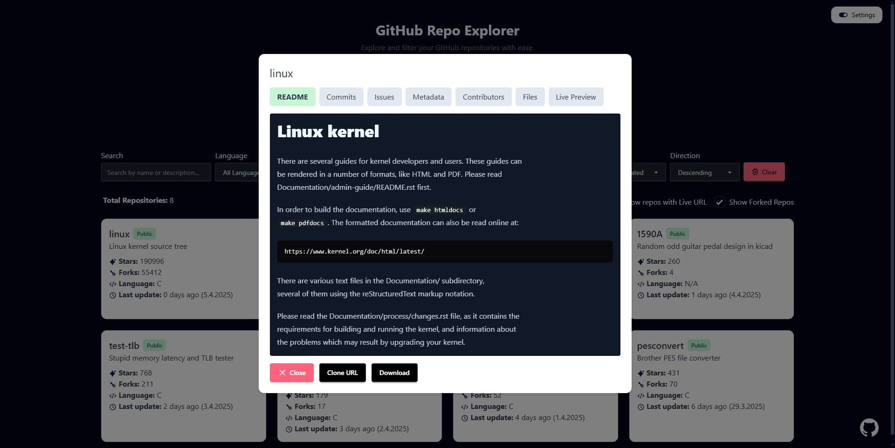
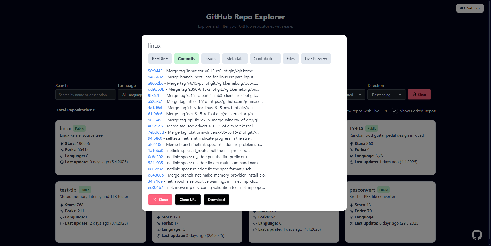

# Repo Explorer

**Repo Explorer** is a web application that allows users to explore and filter GitHub repositories with ease. It provides features like repository search, filtering, and detailed views of commits, issues, metadata, contributors, and file structures.


Check it out at [Repo Explorer](https://gh.berkankutuk.dk/).

## Features

- **GitHub Authentication** using a Personal Access Token  
- **Repository Search** by name or description  
- **Advanced Filtering**  
  - Filter by language, visibility (public/private), archived status  
  - Template or non-template repositories  
  - Include or exclude forked repositories  
  - Minimum stars and forks  
  - Show only repositories with active issues  
  - Show only repositories with a live preview URL  
- **Sorting Options**  
  - Sort repositories by name, stars, forks, language, last updated or visibility  
- **Detailed Repository View** with tabbed interface  
  - README, commits, issues, metadata, contributors, file structure, and live preview  
- **Repository Actions**  
  - Copy clone URL to clipboard  
  - Download repository as ZIP  
- **Live Preview Support**  
  - Embedded iframe if a live URL is available  
  - Auto-detection and linking to GitHub Pages  
- **Repository Metadata**  
  - Display branches, topics, license, stars, watchers, creation date, and last updated  
- **Contributor Overview**  
  - List contributors with avatar, profile link, and number of commits  
- **Interactive File Browser** for exploring repo structure  
- **Responsive Design** optimized for all device sizes  
- **Quick Filter Reset** button to clear all applied filters


## Screenshots

<details>
<summary>Readme Overiew</summary>


</details>

<details>
<summary>Commits Overview</summary>


</details>

<details>
<summary>Responsive File Browsing</summary>


</details>

## Getting Started

### Prerequisites

- Node.js (v16 or higher)
- npm or yarn

### Installation

1. Clone the repository:

   ```bash
   git clone https://github.com/Berkanktk/RepoExplorer.git
   cd RepoExplorer
   ```

2. Install dependencies:

   ```bash
   npm install
   ```

3. Start the development server:

   ```bash
   npm run dev
   ```

4. Open the app in your browser at [http://localhost:5173](http://localhost:5173).

### Building for Production

To build the app for production:

```bash
npm run build
```

The production-ready files will be in the `build/` directory.

### Preview Production Build

To preview the production build locally:

```bash
npm run preview
```

## Usage

1. **Authenticate**:
   - Enter your GitHub personal access token in the **Config Panel**.
   - Optionally, save the token for future use.

2. **Search Repositories**:
   - Enter a GitHub username to fetch repositories.
   - Use filters to narrow down the results.

3. **Explore Repositories**:
   - Click on a repository to view its details, including README, commits, issues, metadata, contributors, and file structure.

4. **Live Preview**:
   - See deployments of Pages or other live URLs directly in the app.

## Configuration

### GitHub Personal Access Token

To use the app, you need a GitHub personal access token with the following permissions:

- `metadata` - Read-only access to metadata.
- `content` - Read-only access to repositories.
- `deployments` - Read-only access to deployments.
- `issues` - Read-only access to issues.

You can generate a token [here](https://github.com/settings/personal-access-tokens).

## Technologies Used

- **Frontend**: [SvelteKit](https://kit.svelte.dev/)
- **Styling**: [Tailwind CSS](https://tailwindcss.com/), [DaisyUI](https://daisyui.com/)
- **Markdown Rendering**: [Markdown-It](https://github.com/markdown-it/markdown-it)
- **Icons**: Custom SVG icons

## Folder Structure

```
RepoExplorer/
├── src/
│   ├── lib/
│   │   ├── components/    # Svelte components
│   │   ├── stores/        # Svelte stores
│   │   ├── utils/         # Utility functions
│   │   └── types.ts       # TypeScript types
│   ├── routes/            # SvelteKit routes
│   ├── app.css            # Global styles
│   └── app.html           # HTML template
├── static/                # Static assets (e.g., icons)
├── package.json           # Project metadata and dependencies
├── tailwind.config.js     # Tailwind CSS configuration
├── svelte.config.js       # SvelteKit configuration
└── vite.config.ts         # Vite configuration
```

## Contributing

Contributions are welcome! If you'd like to contribute, please fork the repository and submit a pull request.

## License

This project is licensed under the [MIT License](LICENSE).

## Acknowledgments

- [GitHub API](https://docs.github.com/en/rest)
- [SvelteKit](https://kit.svelte.dev/)
- [Tailwind CSS](https://tailwindcss.com/)
- [DaisyUI](https://daisyui.com/)
